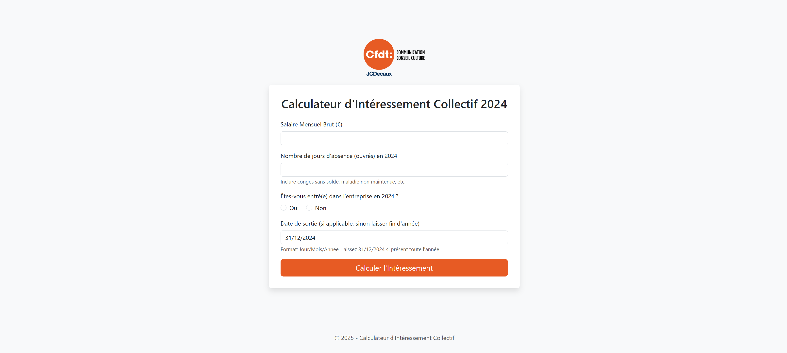
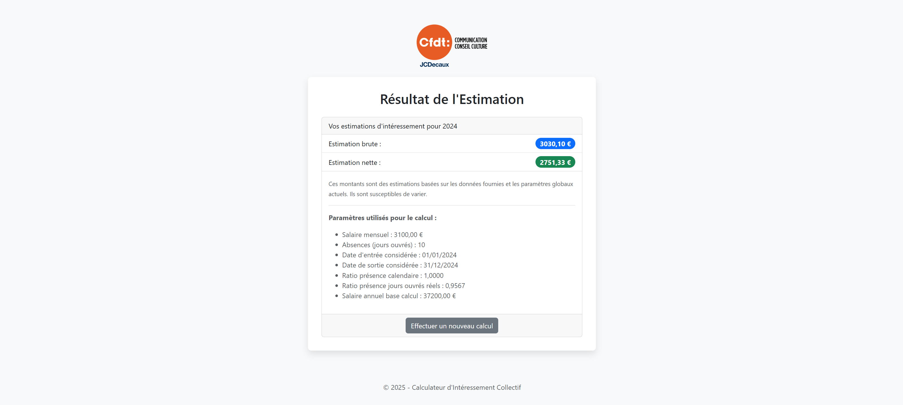

# Collective Interest Calculator

  

A simple web application built with Flask to estimate the French "intéressement" (profit-sharing bonus) for an employee based on individual and global company data.



## Description

This tool provides an estimation of the gross and net intéressement amount an employee might receive. It takes into account:

*   Monthly gross salary.
*   Number of absence days.
*   Employee entry and exit dates within the calculation year (2024).
*   Predefined global parameters such as the total intéressement envelope, total number of beneficiaries, total company payroll, and total working days in the year.

The calculation logic follows a common model where the intéressement is split into parts based on presence and salary.

The interface is designed to be clean, simple, and modern, using Bootstrap 5 for styling and responsiveness. The application is in French.

## Features

*   Calculates estimated gross intéressement.
*   Calculates estimated net intéressement.
*   User-friendly web form for input.
*   Handles employees joining mid-year with conditional date input.
*   Uses configurable global parameters defined in `app.py`.
*   Responsive design using Bootstrap 5.
*   French language interface and number formatting (comma decimal separator).

## Technologies Used

*   **Python 3.12**
*   **Flask:** Micro web framework for the backend.
*   **Jinja2:** Templating engine (comes with Flask) for rendering HTML.
*   **HTML5:** Structure of the web pages.
*   **CSS3:** Styling, primarily via **Bootstrap 5** (CDN) and custom styles in `static/css/style.css`.
*   **JavaScript:** Basic client-side script for form interactivity (showing/hiding date input).

## Setup and Installation

1.  **Clone the repository:**
    ```bash
    git clone https://github.com/mohamedhayballa22/cic.git
    cd cic
    ```

2.  **Create and activate a virtual environment (Recommended):**
    *   On macOS/Linux:
        ```bash
        python3 -m venv venv
        source venv/bin/activate
        ```
    *   On Windows:
        ```bash
        python -m venv venv
        .\venv\Scripts\activate
        ```

3.  **Install dependencies:**
    ```bash
    pip install -r requirements.txt
    ```

4.  **Run the application:**
    ```bash
    python app.py
    ```
    The application will start in debug mode (useful for development).

5. **Switch to development branch:**

    Locally, make sure HEAD is on the dev branch to be able to run the application.
    ```bash
    git switch dev
    ```

5.  **Access the application:**
    Open your web browser and navigate to `http://127.0.0.1:5000`.

## Usage

1.  Open the application in your web browser.
2.  Fill in the required fields:
    *   `Salaire Mensuel Brut (€)`: Your gross monthly salary.
    *   `Nombre de jours d'absence (ouvrés) en 2024`: Number of working days absent in 2024 (e.g., unpaid leave).
    *   Answer `Êtes-vous entré(e) dans l'entreprise en 2024 ?`:
        *   If `Oui` (Yes), provide your `Date d'entrée en 2024` (Format: JJ/MM/AAAA).
        *   If `Non` (No), the entry date defaults to 01/01/2024.
    *   `Date de sortie`: Your exit date if you left during 2024 (Format: JJ/MM/AAAA). Leave as `31/12/2024` if you stayed the whole year.
3.  Click the `Calculer l'Intéressement` button.
4.  The results page will display the estimated gross and net amounts, along with the parameters used for the calculation.
5.  Click `Effectuer un nouveau calcul` to return to the form.

